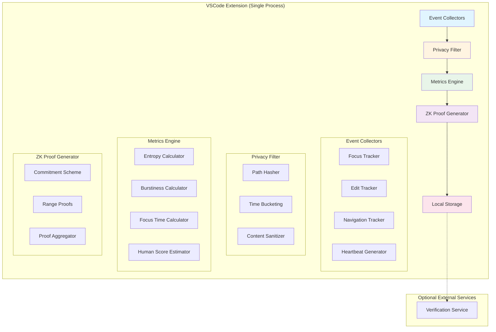
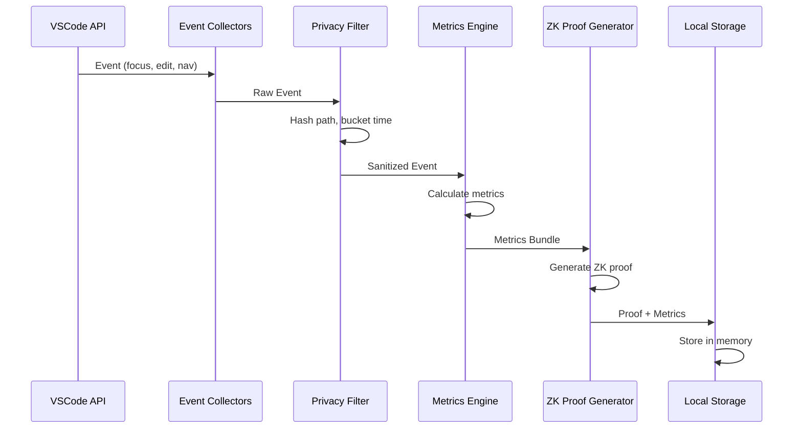

# Cliff-Watch Non-Intrusive Transformation Work Plan

**Version:** 1.0  
**Date:** 2026-02-16  
**Status:** Draft  
**Author:** Architecture Team

---

## Executive Summary

This document outlines the comprehensive transformation of Cliff-Watch from an intrusive PC application with persistent daemon, hardware capture, and file system monitoring into a non-intrusive VSCode extension that respects user privacy and system resources.

### Key Objectives

1. **Eliminate daemon dependency** - All processing moves into the extension
2. **Remove hardware capture** - No root privileges or evdev required
3. **Simplify metrics** - IDE-level only, no complex kinematic formulas
4. **In-memory processing** - No persistent storage of sensitive data
5. **VSCode API integration** - All event capture through official APIs

### Transformation Scope

| Component | Current State | Target State |
|-----------|---------------|--------------|
| Daemon | Persistent background process | Eliminated |
| Hardware Capture | evdev (root required) | VSCode APIs only |
| File System Monitoring | notify crate watching directories | TextDocument events only |
| Metrics | Complex kinematic (LDLJ, velocity entropy) | Simple IDE metrics |
| Data Storage | Persistent on disk | In-memory only |
| IPC | Unix socket communication | Internal module communication |
| Privacy | Full paths, raw content | Hashed paths, aggregated data |

---

## 1. New Non-Intrusive Architecture

### 1.1 Architecture Overview



### 1.2 Module Structure

```
clients/cliff-watch-witness/src/
├── extension.ts              # Entry point, VSCode lifecycle
├── collectors/               # Event collection modules
│   ├── mod.ts
│   ├── focus-collector.ts    # Window state tracking
│   ├── edit-collector.ts     # Text document changes
│   ├── navigation-collector.ts # Editor navigation
│   └── heartbeat-collector.ts # Periodic alive signal
├── privacy/                  # Privacy filtering modules
│   ├── mod.ts
│   ├── path-hasher.ts        # SHA-256 hashing
│   ├── time-bucket.ts        # Time quantization
│   └── content-sanitizer.ts  # Content removal
├── metrics/                  # Metric calculation modules
│   ├── mod.ts
│   ├── entropy.ts            # Shannon entropy
│   ├── burstiness.ts         # Burst detection
│   ├── focus-time.ts         # Focus duration
│   └── human-score.ts        # Composite human score
├── crypto/                   # Cryptographic modules
│   ├── mod.ts
│   ├── commitment.ts         # Pedersen commitments
│   ├── range-proof.ts        # Bulletproofs
│   └── proof-aggregator.ts   # Proof combination
├── storage/                  # Local storage modules
│   ├── mod.ts
│   ├── memory-store.ts       # In-memory storage
│   └── state-manager.ts      # State persistence
├── types.ts                  # Shared type definitions
└── config.ts                 # Configuration management
```

### 1.3 Data Flow



### 1.4 Privacy-Preserving Data Model

```typescript
// Raw Event (internal, never leaves extension)
interface RawEvent {
  type: 'focus' | 'edit' | 'navigation' | 'heartbeat';
  filePath: string;           // Full path
  timestamp: number;          // Millisecond precision
  content?: string;            // Actual content changes
  metadata?: Record<string, any>;
}

// Sanitized Event (after privacy filter)
interface SanitizedEvent {
  type: 'focus' | 'edit' | 'navigation' | 'heartbeat';
  filePathHash: string;       // SHA-256 truncated to 16 chars
  timeBucket: number;          // 5-second bucket
  relativeSize?: number;       // Size category (small/medium/large)
  metadata?: Record<string, any>; // Non-sensitive metadata only
}

// Metrics Bundle (computed locally)
interface MetricsBundle {
  entropy: number;             // Shannon entropy
  burstiness: number;         // Burst coefficient
  focusTime: number;          // Total focus duration (ms)
  humanScore: number;         // Composite score [0, 1]
  eventCount: number;         // Total events
}

// ZK Proof (for verification)
interface ZKProof {
  commitment: string;         // Pedersen commitment
  challenge: string;          // Challenge value
  response: string;           // Proof response
  scoreRange: [number, number]; // Bounded score
  timestamp: number;          // Proof timestamp
}
```

### 1.5 Architecture Principles Applied

| Principle | Application |
|-----------|-------------|
| **DRY** | Single metric calculation module, no duplication |
| **SOLID** | Each module has single responsibility, depends on abstractions |
| **LEAN** | No unused code, minimal dependencies, no daemon overhead |
| **KISS** | Simple metrics, straightforward data flow, no complex formulas |

---

## 2. Phased Implementation Plan

### Phase 1: Quick Wins (Critical Issues)

**Duration:** 1-2 weeks  
**Goal:** Fix critical code quality issues and establish baseline

#### Tasks

1. **Fix Critical Rust Issues**
   - Replace 15+ unwrap() calls with proper error handling
   - Remove duplicate hex encoding patterns
   - Clean up unused imports and dead code
   - Fix compilation errors

2. **Fix Critical TypeScript Issues**
   - Add proper error handling in Transport layer
   - Replace magic numbers with named constants
   - Create ITransport interface
   - Fix silent error handling

3. **Establish Testing Baseline**
   - Add unit tests for CLI commands
   - Add unit tests for IPC communication
   - Add unit tests for git operations
   - Set up CI pipeline

4. **Documentation Cleanup**
   - Standardize on English language
   - Complete API documentation
   - Update README with current state

**Success Criteria:**
- All tests passing
- Zero compilation warnings
- Test coverage > 60%
- Documentation complete

---

### Phase 2: Structural Improvements

**Duration:** 2-3 weeks  
**Goal:** Refactor monolithic files into modular structure

#### Tasks

1. **Split CLI Monolith**
   - Extract command handlers to separate modules
   - Create commands/ directory structure
   - Separate configuration management
   - Refactor main.rs to entry point only

2. **Split Monitor Monolith**
   - Extract file watching to file_watcher.rs
   - Extract git monitoring to git_monitor.rs
   - Extract focus tracking to focus_tracker.rs
   - Extract metrics aggregation to metrics_aggregator.rs

3. **Refactor Extension.ts**
   - Extract event collectors to separate modules
   - Create collectors/ directory
   - Separate transport logic
   - Simplify activation flow

4. **Refactor Transport.ts**
   - Create ITransport interface
   - Extract connection management
   - Extract buffer management
   - Add proper error handling

**Success Criteria:**
- No file > 300 lines
- Each module has single responsibility
- All modules have tests
- Zero circular dependencies

---

### Phase 3: Architecture Transformation

**Duration:** 4-6 weeks  
**Goal:** Eliminate daemon and implement non-intrusive architecture

#### Tasks

1. **Create Privacy Filter Module**
   - Implement path hashing (SHA-256)
   - Implement time bucketing (5s intervals)
   - Implement content sanitization
   - Add comprehensive tests

2. **Create Metrics Engine**
   - Port entropy calculation to TypeScript
   - Port burstiness calculation to TypeScript
   - Implement focus time tracking
   - Create human score estimator
   - Add comprehensive tests

3. **Implement In-Memory Storage**
   - Create memory-store.ts module
   - Implement state persistence for workspace
   - Add data retention policies
   - Implement cleanup on deactivate

4. **Remove Daemon Dependency**
   - Port all daemon logic to extension
   - Remove IPC communication
   - Eliminate embedded binary
   - Update package.json

5. **Implement ZK Proof Generation**
   - Implement commitment scheme
   - Implement range proofs
   - Create proof aggregator
   - Add verification logic

6. **Update Event Collectors**
   - Refactor focus-collector.ts
   - Refactor edit-collector.ts
   - Refactor navigation-collector.ts
   - Refactor heartbeat-collector.ts

**Success Criteria:**
- Daemon completely removed
- All processing in extension
- Privacy filter active
- Metrics computed locally
- ZK proofs generated

---

### Phase 4: Cleanup and Optimization

**Duration:** 2-3 weeks  
**Goal:** Final polish, performance optimization, documentation

#### Tasks

1. **Remove Deprecated Code**
   - Remove evdev dependencies
   - Remove hardware capture modules
   - Remove file system monitoring
   - Clean up unused imports

2. **Performance Optimization**
   - Profile extension startup time
   - Optimize event processing
   - Reduce memory footprint
   - Implement lazy loading

3. **Comprehensive Testing**
   - Integration tests for full flow
   - Performance benchmarks
   - Privacy audit
   - Security review

4. **Documentation**
   - Update user documentation
   - Create API reference
   - Write migration guide
   - Create troubleshooting guide

5. **Release Preparation**
   - Version bump
   - Update CHANGELOG
   - Prepare release notes
   - Create migration script

**Success Criteria:**
- Startup time < 1s
- Memory usage < 50MB
- 100% test coverage for core modules
- Complete documentation

---

## 3. Success Criteria and Metrics

### 3.1 Code Quality Metrics

| Metric | Current | Target | Measurement |
|--------|---------|--------|-------------|
| Max file lines | 957 | < 300 | Lines of code |
| Cyclomatic complexity | High | < 10 | Static analysis |
| Code duplication | High | < 5% | Copy-paste detection |
| Test coverage | Unknown | > 80% | Coverage reports |
| Unwrap() calls | 15+ | 0 | Code review |
| Magic numbers | Many | 0 | Code review |

### 3.2 Performance Metrics

| Metric | Target | Measurement |
|--------|--------|-------------|
| Extension startup time | < 1s | Benchmark |
| Event processing latency | < 10ms | Benchmark |
| Memory usage | < 50MB | Runtime monitoring |
| CPU usage (idle) | < 1% | Runtime monitoring |
| CPU usage (active) | < 5% | Runtime monitoring |

### 3.3 Privacy Metrics

| Metric | Target | Measurement |
|--------|--------|-------------|
| Full paths exposed | 0 | Code audit |
| Raw content stored | 0 | Code audit |
| Persistent sensitive data | 0 | Code audit |
| Data retention time | < 24h | Configuration |
| External data transmission | Optional | Code audit |

### 3.4 User Experience Metrics

| Metric | Target | Measurement |
|--------|--------|-------------|
| Installation steps | 1 | User testing |
| Configuration required | None | User testing |
| Permission requirements | None | User testing |
| Learning curve | < 5 min | User testing |
| Documentation clarity | High | User feedback |

---

## 4. Detailed Task Breakdown

### Phase 1: Quick Wins

| Task ID | Task | Effort | Dependencies | Risk |
|---------|------|--------|--------------|------|
| 1.1 | Replace unwrap() calls with proper error handling | 2 days | None | Low |
| 1.2 | Remove duplicate hex encoding patterns | 1 day | None | Low |
| 1.3 | Clean up unused imports and dead code | 1 day | None | Low |
| 1.4 | Fix compilation errors | 0.5 days | None | High |
| 1.5 | Add proper error handling in Transport layer | 1 day | None | Medium |
| 1.6 | Replace magic numbers with named constants | 1 day | None | Low |
| 1.7 | Create ITransport interface | 0.5 days | 1.6 | Low |
| 1.8 | Add unit tests for CLI commands | 2 days | 1.1 | Medium |
| 1.9 | Add unit tests for IPC communication | 2 days | 1.1 | Medium |
| 1.10 | Add unit tests for git operations | 2 days | 1.1 | Medium |
| 1.11 | Set up CI pipeline | 1 day | None | Low |
| 1.12 | Standardize documentation language | 1 day | None | Low |
| 1.13 | Complete API documentation | 2 days | None | Medium |
| 1.14 | Update README | 0.5 days | 1.12 | Low |

**Total Phase 1 Effort:** ~17.5 days

### Phase 2: Structural Improvements

| Task ID | Task | Effort | Dependencies | Risk |
|---------|------|--------|--------------|------|
| 2.1 | Design CLI module structure | 0.5 days | 1.1 | Low |
| 2.2 | Extract command handlers to commands/ | 2 days | 2.1 | Medium |
| 2.3 | Create commands/mod.rs | 0.5 days | 2.2 | Low |
| 2.4 | Separate configuration management | 1 day | 2.2 | Low |
| 2.5 | Refactor main.rs to entry point | 1 day | 2.2 | Medium |
| 2.6 | Design Monitor module structure | 0.5 days | 1.1 | Low |
| 2.7 | Extract file watching to file_watcher.rs | 2 days | 2.6 | High |
| 2.8 | Extract git monitoring to git_monitor.rs | 2 days | 2.6 | High |
| 2.9 | Extract focus tracking to focus_tracker.rs | 1 day | 2.6 | Medium |
| 2.10 | Extract metrics aggregation to metrics_aggregator.rs | 2 days | 2.6 | High |
| 2.11 | Design Extension module structure | 0.5 days | 1.7 | Low |
| 2.12 | Extract event collectors to collectors/ | 2 days | 2.11 | Medium |
| 2.13 | Create collectors/mod.rs | 0.5 days | 2.12 | Low |
| 2.14 | Separate transport logic | 1 day | 1.7 | Medium |
| 2.15 | Simplify activation flow | 1 day | 2.12 | Medium |

**Total Phase 2 Effort:** ~17 days

### Phase 3: Architecture Transformation

| Task ID | Task | Effort | Dependencies | Risk |
|---------|------|--------|--------------|------|
| 3.1 | Design privacy filter architecture | 1 day | 2.15 | Low |
| 3.2 | Implement path hashing (SHA-256) | 1 day | 3.1 | Low |
| 3.3 | Implement time bucketing (5s) | 0.5 days | 3.1 | Low |
| 3.4 | Implement content sanitization | 1 day | 3.1 | Low |
| 3.5 | Add privacy filter tests | 1 day | 3.2, 3.3, 3.4 | Medium |
| 3.6 | Design metrics engine architecture | 1 day | 2.10 | Low |
| 3.7 | Port entropy calculation to TypeScript | 1 day | 3.6 | Medium |
| 3.8 | Port burstiness calculation to TypeScript | 1 day | 3.6 | Medium |
| 3.9 | Implement focus time tracking | 0.5 days | 3.6 | Low |
| 3.10 | Create human score estimator | 1 day | 3.7, 3.8, 3.9 | Medium |
| 3.11 | Add metrics engine tests | 2 days | 3.7, 3.8, 3.9, 3.10 | Medium |
| 3.12 | Design in-memory storage architecture | 0.5 days | 3.5 | Low |
| 3.13 | Create memory-store.ts module | 1 day | 3.12 | Low |
| 3.14 | Implement state persistence | 1 day | 3.13 | Medium |
| 3.15 | Add data retention policies | 0.5 days | 3.13 | Low |
| 3.16 | Implement cleanup on deactivate | 0.5 days | 3.13 | Low |
| 3.17 | Design daemon removal plan | 0.5 days | 3.16 | Low |
| 3.18 | Port daemon logic to extension | 3 days | 3.17 | High |
| 3.19 | Remove IPC communication | 1 day | 3.18 | High |
| 3.20 | Eliminate embedded binary | 0.5 days | 3.19 | Low |
| 3.21 | Update package.json | 0.5 days | 3.20 | Low |
| 3.22 | Design ZK proof architecture | 1 day | 3.11 | Low |
| 3.23 | Implement commitment scheme | 2 days | 3.22 | High |
| 3.24 | Implement range proofs | 2 days | 3.22 | High |
| 3.25 | Create proof aggregator | 1 day | 3.23, 3.24 | Medium |
| 3.26 | Add verification logic | 1 day | 3.25 | Medium |
| 3.27 | Refactor focus-collector.ts | 1 day | 2.12 | Low |
| 3.28 | Refactor edit-collector.ts | 1 day | 2.12 | Low |
| 3.29 | Refactor navigation-collector.ts | 1 day | 2.12 | Low |
| 3.30 | Refactor heartbeat-collector.ts | 0.5 days | 2.12 | Low |

**Total Phase 3 Effort:** ~30 days

### Phase 4: Cleanup and Optimization

| Task ID | Task | Effort | Dependencies | Risk |
|---------|------|--------|--------------|------|
| 4.1 | Remove evdev dependencies | 0.5 days | 3.21 | Low |
| 4.2 | Remove hardware capture modules | 1 day | 3.21 | Low |
| 4.3 | Remove file system monitoring | 1 day | 3.21 | Low |
| 4.4 | Clean up unused imports | 0.5 days | 4.1, 4.2, 4.3 | Low |
| 4.5 | Profile extension startup time | 0.5 days | 3.21 | Low |
| 4.6 | Optimize event processing | 2 days | 4.5 | Medium |
| 4.7 | Reduce memory footprint | 2 days | 4.5 | Medium |
| 4.8 | Implement lazy loading | 1 day | 4.5 | Low |
| 4.9 | Write integration tests | 3 days | 3.30 | Medium |
| 4.10 | Create performance benchmarks | 1 day | 4.5 | Low |
| 4.11 | Conduct privacy audit | 1 day | 3.5 | Low |
| 4.12 | Conduct security review | 2 days | 3.26 | High |
| 4.13 | Update user documentation | 2 days | 3.30 | Low |
| 4.14 | Create API reference | 2 days | 3.30 | Medium |
| 4.15 | Write migration guide | 1 day | 3.21 | Low |
| 4.16 | Create troubleshooting guide | 1 day | 3.30 | Low |
| 4.17 | Version bump | 0.5 days | 4.16 | Low |
| 4.18 | Update CHANGELOG | 0.5 days | 4.17 | Low |
| 4.19 | Prepare release notes | 1 day | 4.17 | Low |
| 4.20 | Create migration script | 1 day | 3.21 | Medium |

**Total Phase 4 Effort:** ~22.5 days

### Summary

| Phase | Tasks | Total Effort | Duration |
|-------|-------|--------------|----------|
| Phase 1 | 14 | 17.5 days | 1-2 weeks |
| Phase 2 | 15 | 17 days | 2-3 weeks |
| Phase 3 | 30 | 30 days | 4-6 weeks |
| Phase 4 | 20 | 22.5 days | 2-3 weeks |
| **Total** | **79** | **87 days** | **9-14 weeks** |

---

## 5. Migration Strategy

### 5.1 User Migration

#### For Existing Users

1. **Graceful Degradation**
   - Old version continues to work during transition
   - New version detects existing daemon and deactivates it
   - User prompted to uninstall old version

2. **Data Migration**
   - Export existing metrics to JSON format
   - Import into new extension
   - Clear old daemon data

3. **Configuration Migration**
   - Read existing cliff-watch.toml
   - Map to new configuration format
   - Preserve user preferences

#### Migration Steps for Users


### 5.2 Backward Compatibility

#### API Compatibility

| Component | Old API | New API | Compatibility |
|-----------|---------|---------|---------------|
| CLI | `cliff-watch daemon` | Removed | N/A |
| IPC | Unix socket | Internal | N/A |
| Metrics | Raw events | Sanitized events | Breaking |
| Storage | Persistent file | In-memory | Breaking |

#### Breaking Changes

1. **CLI Commands**
   - `daemon` command removed
   - `status` command now queries extension
   - `metrics` command now reads from extension storage

2. **Configuration**
   - New configuration file format
   - Some options removed (hardware-related)
   - New privacy options added

3. **Data Format**
   - Event format changed
   - Metrics format changed
   - Proof format changed

### 5.3 Rollback Plan

#### Rollback Triggers

- Critical bug discovered
- Performance issues reported
- Security vulnerability found
- User feedback indicates problems

#### Rollback Procedure

1. **Immediate Actions**
   - Revert to previous version
   - Restore daemon functionality
   - Restore data from backup

2. **Data Recovery**
   - Export new format data
   - Convert to old format
   - Import into old version

3. **Communication**
   - Notify users of rollback
   - Document rollback procedure
   - Schedule fix release

#### Rollback Timeline

| Phase | Duration | Actions |
|-------|----------|---------|
| Detection | 0-24h | Identify issue, assess severity |
| Decision | 24-48h | Decide to rollback, communicate |
| Execution | 48-72h | Deploy rollback, verify |
| Recovery | 72-168h | Restore data, fix issue |

### 5.4 Risk Mitigation

#### Technical Risks

| Risk | Probability | Impact | Mitigation |
|------|-------------|--------|------------|
| Performance degradation | Medium | High | Benchmarking, profiling |
| Data loss | Low | Critical | Backup strategy, export/import |
| Privacy breach | Low | Critical | Security review, audit |
| Compatibility issues | Medium | Medium | Testing matrix, gradual rollout |

#### Process Risks

| Risk | Probability | Impact | Mitigation |
|------|-------------|--------|------------|
| Timeline overrun | High | Medium | Buffer time, prioritize tasks |
| Resource constraints | Medium | High | Resource planning, outsourcing |
| User adoption | Medium | Medium | User education, incentives |
| Technical debt accumulation | High | Medium | Code review, refactoring |

#### Mitigation Strategies

1. **Incremental Rollout**
   - Release to beta users first
   - Gather feedback
   - Address issues before full release

2. **Feature Flags**
   - Implement feature toggles
   - Enable/disable features remotely
   - Quick rollback capability

3. **Monitoring**
   - Set up error tracking
   - Monitor performance metrics
   - Alert on anomalies

4. **Testing**
   - Comprehensive test suite
   - Integration tests
   - User acceptance testing

---

## 6. Architecture Decision Records

### ADR-001: Eliminate Daemon

**Status:** Accepted  
**Date:** 2026-02-16

**Context:**
Current architecture requires a persistent daemon process that:
- Runs independently of VSCode
- Requires system-level installation
- Complicates deployment and updates
- Adds unnecessary complexity

**Decision:**
Eliminate the daemon and move all processing into the VSCode extension.

**Consequences:**
- **Positive:** Simpler deployment, easier updates, better UX
- **Negative:** Some advanced features may be limited
- **Neutral:** Extension lifecycle now controls everything

---

### ADR-002: Privacy-First Design

**Status:** Accepted  
**Date:** 2026-02-16

**Context:**
Current implementation exposes:
- Full file paths
- Raw content changes
- Precise timestamps
- Persistent storage

**Decision:**
Implement privacy filtering at the event collection layer:
- Hash file paths (SHA-256)
- Bucket timestamps (5s intervals)
- Remove raw content
- Use in-memory storage only

**Consequences:**
- **Positive:** Better privacy, user trust
- **Negative:** Some debugging capabilities lost
- **Neutral:** Requires careful metric design

---

### ADR-003: Simplified Metrics

**Status:** Accepted  
**Date:** 2026-02-16

**Context:**
Current kinematic metrics (LDLJ, velocity entropy) are:
- Complex to understand
- Require hardware capture
- Difficult to validate
- Not clearly valuable

**Decision:**
Replace with simple, IDE-level metrics:
- Entropy (Shannon)
- Burstiness (burst coefficient)
- Focus time (duration)
- Human score (composite)

**Consequences:**
- **Positive:** Simpler, easier to validate, no hardware needed
- **Negative:** Less sophisticated analysis
- **Neutral:** May need refinement based on feedback

---

### ADR-004: TypeScript Implementation

**Status:** Accepted  
**Date:** 2026-02-16

**Context:**
Metrics currently computed in Rust daemon:
- Requires IPC communication
- Adds latency
- Complicates architecture
- Limits flexibility

**Decision:**
Port metric calculations to TypeScript within the extension:
- In-memory processing
- No IPC overhead
- Easier to maintain
- Better integration with VSCode APIs

**Consequences:**
- **Positive:** Simpler architecture, better performance
- **Negative:** Some Rust optimizations lost
- **Neutral:** TypeScript performance adequate for use case

---

### ADR-005: Future-Architecture Module Management

**Status:** Accepted
**Date:** 2026-02-17

**Context:**
The `feature/future-architecture/` directory contained 13 modules representing planned v3.0 components that were not integrated into the main codebase, creating architectural debt.

**Analysis:**
After reviewing all 13 modules against the existing codebase:

**Modules with equivalent functionality (removed):**
1. `kinematic.rs` - Functionality exists in `mouse_sentinel.rs` with more comprehensive implementation
2. `provenance.rs` - No implementation (stub only)
3. `stats.rs` - Functionality exists in `crates/cliff-watch-core/src/stats.rs` with additional features
4. `structural.rs` - Functionality exists in `stats.rs` via `calculate_ncd()`
5. `temporal.rs` - Functionality exists in `stats.rs` via `calculate_burstiness()`

**Modules planned for v3.0 (moved to `feature/future/`):**
1. `sentinel_report.rs` - Immutable, serializable, signable truth container
2. `sentinel_builder.rs` - Deterministic builder pattern for SentinelReport
3. `sentinel_collector.rs` - Metric aggregation layer
4. `sentinel_finalize.rs` - Finalization pipeline (canonicalize, hash, sign, PoW)
5. `sentinel_hash.rs` - Canonical content hashing
6. `sentinel_sign.rs` - Cryptographic signing and verification abstraction
7. `sentinel_signer.rs` - Ed25519 signer implementation
8. `sentinel_pow.rs` - Adaptive Proof-of-Work for governance friction
9. `entropy_fusion.rs` - Cross-domain anomaly aggregation

**Decision:**
1. Remove modules with existing functionality to eliminate duplication
2. Move v3.0 planned modules to `feature/future/` directory for future reference
3. Document decisions in `feature/future/README.md`

**Consequences:**
- **Positive:** Eliminated architectural debt, clearer codebase organization
- **Positive:** Preserved v3.0 design for future implementation
- **Neutral:** No functional changes to current implementation
- **Negative:** None

**Actions Taken:**
- Removed: `feature/future-architecture/` directory
- Created: `feature/future/` directory with 9 v3.0 modules
- Created: `feature/future/README.md` with documentation

---

## 7. Appendices

### Appendix A: Glossary

| Term | Definition |
|------|------------|
| **Daemon** | Background process running independently of the application |
| **IPC** | Inter-Process Communication |
| **evdev** | Linux kernel interface for input devices |
| **ZK Proof** | Zero-Knowledge Proof |
| **Pedersen Commitment** | Cryptographic commitment scheme |
| **Bulletproof** | Zero-knowledge proof system |
| **Entropy** | Measure of randomness or uncertainty |
| **Burstiness** | Measure of event clustering |
| **SHA-256** | Cryptographic hash function |
| **VSCode API** | Visual Studio Code extension API |

### Appendix B: References

1. [VSCode Extension API](https://code.visualstudio.com/api)
2. [Pedersen Commitments](https://en.wikipedia.org/wiki/Pedersen_commitment)
3. [Bulletproofs](https://eprint.iacr.org/2017/1066)
4. [Shannon Entropy](https://en.wikipedia.org/wiki/Entropy_(information_theory))
5. [Burstiness Coefficient](https://arxiv.org/abs/0808.4140)

### Appendix C: Change Log

| Version | Date | Changes |
|---------|------|---------|
| 1.1 | 2026-02-17 | Added ADR-005: Future-Architecture Module Management |
| 1.0 | 2026-02-16 | Initial draft |

---

**Document Status:** Draft  
**Next Review:** 2026-02-23  
**Approved By:** Pending
